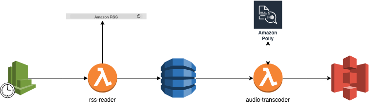
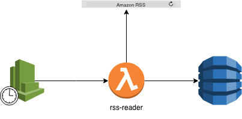
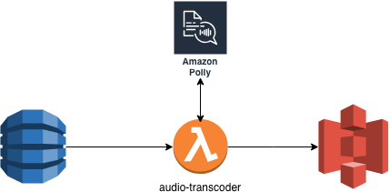
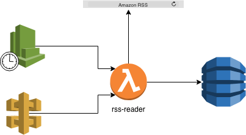

# Serverless-handson
If you are here, you believe that the framework strength came from it community.

In this hands-on we are going to read a rssFeed, convert it to MP3 and saved the feed in database.

We are going to use the folowing service:

- Lambda
- CloudWatch 
- DynamoDB
- Polly
- S3
- Api-gateway

So let's get started :blush:

## First Step : Prepare the field

For this hands-on you need to install node version 8.9
you can use node version manager to handle multiple node version

- The installation instruction are available here: https://github.com/creationix/nvm

- To check you install: `nvm --version`

- Now you can install node 8.9.4 using : `nvm i 8.9.4`

- To check you node default version: `node --version`

- You can use `nvm use 8.9.4` to switch node version

- To install Serverless you can copy and paste this command in your terminal : `npm install -g serverless`

- To check you Serverless version: `serverless --version`

## Second Step : Prepare the weapon

Now you can checkout the projet and start coding :cloud:

- In the audio-transcoder folder you have to run `npm i` to install the function depencencies
- In the audio-rss-reader folder you have to run `npm i` to install the function depencencies

## Third Step : Fight

### Create the Rss reader function

The RssReader function read every day the aws rssFeed and save it on dynamoDB

The function code is availaible on the package rs-reader

- Create the RssReaderRole:
    
    https://serverless.com/framework/docs/providers/aws/guide/iam/
    
    you should create a role and a policy role. You have to create them in the ressources section on serverless.yml  
      
    
- Launch `serverless deploy` to deploy the created role
- You can check the IAM service on the AWS console: 
    
    https://console.aws.amazon.com/iam/home?region=eu-central-1#/home 
- Create your function with the created role and add a scheduled task to launch this lambda every day
    https://serverless.com/framework/docs/providers/aws/guide/functions/
    https://serverless.com/framework/docs/providers/aws/events/schedule/#schedule
    
- Launch `serverless deploy` and check the Lambda service on the AWS console: 
    
    https://eu-central-1.console.aws.amazon.com/lambda/home?region=eu-central-1#/functions
- Create DynamoDB table:
    
    To define a DynamoDB Table, you should add a table description in the serverless.yml ressources section.
    
    https://docs.aws.amazon.com/fr_fr/AWSCloudFormation/latest/UserGuide/aws-resource-dynamodb-table.html
- Add the the table name to the function enviromenent variable  
- Launch `serverless deploy` and check the created table on the AWS console :
    
    https://eu-central-1.console.aws.amazon.com/dynamodb/home?region=eu-central-1#

You can test your function: serverless invoke local --function rss-reader

You can select DynamoDB service and check if you have the last AWS's blog articles
    
### Create the audio transcoder function

- Create the S3 bucket:
    https://docs.aws.amazon.com/fr_fr/AWSCloudFormation/latest/UserGuide/aws-properties-s3-bucket.html
    
- Create the AudioTranscoderRole
    Your function should be able to to acces to cloudwatch, dynamoDB,polly and s3
   
    
- Create and connect the audioTrancoder function with the created role and the dynamoDB steam

- Add the the bucket name to the AudiTranscoder function enviromenent variable  

- launch `serverless deploy` to update your stack

### Trigger the RssReader Manually:

Some time we need to sychronize the articles manually. To do this we are going to make http call.

- Create an http endpoint to trigger the RssReader function
    https://serverless.com/framework/docs/providers/aws/events/apigateway/#simple-http-endpoint

- You can test the new feature by a simple curl
